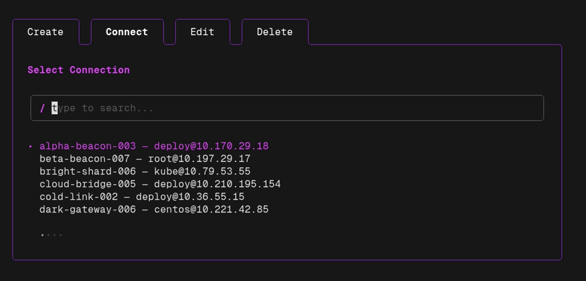
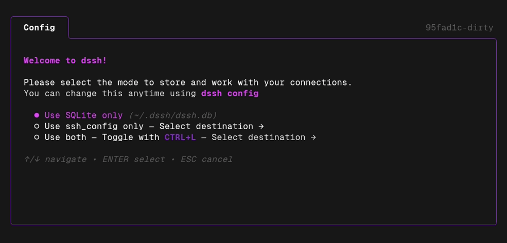

# dssh — **D**ead **S**imple S**SH** (connection manager)

[](https://go.dev)
[](https://github.com/madLinux7/dssh/releases)
[](https://opensource.org/licenses/MIT)
[](https://github.com/madLinux7/dssh/releases)
[](#password-encryption)

The only SSH connection management tool you'll ever need. **CLI & TUI**. No dependencies, no manual file editing.

Four core features: **Create, Connect, Edit, Delete**. Dead-simple and cross-platform.

Store connections in **SQLite**, your **ssh_config** file, or **both** — your choice.

Passwords are encrypted using a master passphrase (_you should consider using pubkeys only tho ;))_.

📚 **Full docs:** [dssh.grolmes.com](https://dssh.grolmes.com)

<p align="center">
  <br>
  <sub>TUI navigation demo</sub>
</p>

<p align="center">
  <br>
  <sub>TUI connect demo</sub>
</p>

<p align="center">
  <br>
  <sub>CLI instant connect demo</sub>
</p>

## Table of Contents

- [Features](#features)
- [How it works](#how-it-works)
- [Connection Modes](#connection-modes)
- [Usage](#usage)
  - [Command Reference](#command-reference)
  - [TUI Navigation](#tui-navigation)
  - [Quick start](#quick-start---lets-go)
  - [Add a connection](#add-a-connection)
  - [Connect to a host](#connect-to-a-host)
  - [Create (TUI)](#create-tui)
  - [Edit (TUI)](#edit-tui)
  - [Delete (TUI)](#delete-tui)
  - [List connections (CLI)](#list-connections-cli)
  - [Remove a connection (CLI)](#remove-a-connection-cli)
  - [Configure mode](#configure-mode)
  - [Reset everything](#reset-everything)
- [Installation](#installation)
  - [Linux](#linux)
    - [AUR (Arch)](#aur-arch)
  - [MacOS](#macos)
    - [Homebrew](#homebrew)
  - [Windows](#windows)
    - [winget](#winget)
    - [scoop](#scoop)
  - [Local User Install & Update script](#local-user-install--update-script)
  - [From GitHub Releases](#from-github-releases)
  - [From source](#from-source)
  - [Build locally](#build-locally)
- [Documentation](#documentation)
- [Contributing](#contributing)
- [Acknowledgements](#-acknowledgements-)

## Features

**Core:**

- **Fancy TUI** ✨ — run `dssh` with no args to connect and manage all your connections
- **Instant connect** 🚀 — `dssh myserver` and you're in
- **Create Wizard** 🪄 — easily add new connections without memorizing flags
- **Edit** ✏️ — no need to delete and re-add connections, just edit them

Also:

- **Multiple storage backends** 🗄️ — use SQLite (`~/.dssh/dssh.db`), your `ssh_config` file, or both
- **Launch into a directory** 📂 — optionally land in a specific remote directory on connect
- **Password encryption** 🔒 — AES-256-GCM + Argon2id, protected by a master passphrase
- **Cross-platform** 💻 — Linux, macOS, Windows, FreeBSD (amd64 + arm64)
- **Dead simple migration** 📦 — moving to a new machine? Just take `~/.dssh/dssh.db` with you. That's it.

## How it works

dssh is a thin wrapper around your system's `ssh` binary:

```text
  ┌──────────────┐   read/write    ┌──────────────────────┐
  │  dssh (CLI   │◄───────────────►│  ~/.dssh/dssh.db     │
  │   or TUI)    │                 │   • connections      │
  └──────┬───────┘                 │   • encrypted passes │
         │                         └──────────────────────┘
         │  key auth: syscall.Exec → ssh  (zero overhead)
         │  pw auth:  fork ssh + SSH_ASKPASS script
         ▼
  ┌──────────────┐
  │     ssh      │────► remote host
  └──────────────┘
```

- **Key auth** — `syscall.Exec` replaces the dssh process with ssh (zero overhead, full terminal control)
- **Password auth** — ssh runs as a child process with `SSH_ASKPASS` to supply the decrypted password (no `sshpass` needed)
- **Data** — connections stored in SQLite (`~/.dssh/dssh.db`), your `ssh_config` file, or both
- **Crypto** — AES-256-GCM encryption with Argon2id key derivation for stored passwords

More on the [security model](https://dssh.grolmes.com/guides/security/) and [configuration](https://dssh.grolmes.com/reference/config/) in the docs.

## Connection Modes

On first launch, dssh asks you to choose a connection mode:



| Mode | Description |
|---|---|
| **SQLite only** | Connections stored in `~/.dssh/dssh.db` (default) |
| **ssh_config only** | Connections read from and written to your `ssh_config` file |
| **Both** | Use SQLite and ssh_config side by side, toggle with `CTRL+L` |

When using **ssh_config** or **both**, you pick a destination file:
- **Main file** — `~/.ssh/config`
- **Directive** — `~/.ssh/config.d/dssh`
- **Custom path** — any file you choose

If the file doesn't exist, dssh offers to create it for you.

Change your mode anytime with `dssh config`. View current settings with `dssh config get` (or `dssh config show`).

> **Note:** Password auth is only available when saving to SQLite. ssh_config entries always use key auth.

## Usage

### Command Reference

| Command | Description |
|---|---|
| `dssh` | Launch interactive connection picker |
| `dssh <name>` | Connect to a saved host by name |
| `dssh <name> -- <args>` | Connect with extra args forwarded to ssh |
| `dssh add [-p PORT] [-d DIR] [-J JUMP] <name> <target> [password]` | Save a new connection |
| `dssh rm <name>` | Delete a saved connection |
| `dssh list` / `dssh ls` | List all saved connections |
| `dssh create` / `dssh new` | Interactive form to create a connection |
| `dssh edit` | Edit an existing connection |
| `dssh delete` | Delete a connection (TUI, triple-confirm) |
| `dssh config` | Configure connection mode (SQLite / ssh_config / both) |
| `dssh config get` / `dssh config show` | Show current configuration |
| `dssh reset` | Delete all data (double confirmation) |
| `dssh --version` | Print version |

### TUI Navigation

| Key | Action |
|---|---|
| `Tab` / `Shift+Tab` | Switch between tabs (always), or move between form fields (Create / Edit) |
| `←` / `→` | Switch between tabs (Connect / Edit list / Delete always; Create / Edit forms when on an empty field, the Save button, or the Save-To toggle) |
| `↑` / `↓` | Navigate lists / move between form fields |
| `Enter` | Select / confirm |
| `Ctrl+L` | Toggle SQLite / ssh_config list (both mode) |
| `Ctrl+T` | Toggle key / password auth (create/edit) |
| `ESC` / `Ctrl+C` | Quit |

### Quick start - Let's Go!

```sh
# Add a connection (will use default pubkey identity)
dssh add myserver root@192.168.1.10

# Connect
dssh myserver

# You're in!

# Permanently delete the connection (no confirmation asked)
dssh rm myserver
```

```sh
# Open the TUI where you can basically do anything
dssh
```

Run `dssh` with no arguments to launch the TUI.

### Add a connection

```sh
# user@host (port 22 by default)
dssh add myserver root@192.168.1.10

# Custom port
dssh add myserver -p 2222 root@192.168.1.10

# SSH URI syntax
dssh add myserver ssh://root@192.168.1.10:2222

# Start in a specific remote directory
dssh add myserver -d /var/www root@192.168.1.10

# Through a jump host (ProxyJump / ssh -J)
dssh add db01 -J jumpuser@bastion.example.com dbadmin@10.0.1.50

# Through a chain of jump hosts
dssh add db01 -J jump1.example.com,jump2.example.com dbadmin@10.0.1.50

# With password (will prompt for master passphrase)
dssh add myserver root@192.168.1.10 'my-ssh-password'
```

### Connect to a host

```sh
# Direct connect by name
dssh myserver

# Pass extra args to ssh
dssh myserver -- -v -L 8080:localhost:80
```

### Create (TUI)

Launch the TUI wizard to create a connection interactively.

```sh
dssh create
dssh new # alias
```


The wizard supports both key-based and password-based authentication. For password auth, you'll be prompted to create a master passphrase on first use.

### Edit (TUI)

Launch the TUI directly on the Edit tab to modify an existing connection.

```sh
dssh edit
```

### Delete (TUI)

Launch the TUI directly on the Delete tab. Requires pressing Enter 3 times on the same item to confirm.

```sh
dssh delete
```

### List connections (CLI)

```sh
dssh list
dssh ls # alias
```

```
NAME                USER       HOST            PORT   AUTH      DIR         JUMP
mike-pulse-001      nomad      10.51.140.154   22     key       -           -
myserver            root       192.168.1.10    22     password  -           -
rpg-server          npc        192.168.188.7   22222  key       /var/larp   -
sharp-nexus-001     deploy     10.105.210.233  22     key       -           jumpuser@bastion
skylink             root       skylink.vps     22     key       -           -
```

### Remove a connection (CLI)

```sh
dssh rm myserver
```
Remove a connection instantly. No confirmation asked.

### Configure mode

Switch between SQLite, ssh_config, or both at any time.

```sh
dssh config
```


View current settings:

```sh
dssh config get
```

```
parse_mode:                      both
ssh_config_parse_destination:    ~/.ssh/config.d/dssh
parse_both_view_mode:            sqlite
parse_both_default_save_target:  sqlite
```

### Reset everything

Wipe all saved connections, encrypted passwords, and settings (deletes the SQLite database). Requires two confirmations to prevent accidents.

```sh
dssh reset
```

```
This will delete ALL saved connections, passwords, and settings. Continue? (yes/no): yes
Are you sure? This cannot be undone. Type 'reset' to confirm: reset
All data has been reset
```

## Installation

### Linux

#### AUR (Arch)

```sh
yay -S dssh
```

```sh
paru -S dssh
```

_Other package managers following soon!_

### MacOS

#### Homebrew

```sh
brew install madLinux7/tap/dssh
```

### Windows

#### winget

```ps1
winget install madLinux.dssh
```
#### scoop

```sh
# add scoop bucket (if not done already)
scoop bucket add madLinux7_scoop-bucket https://github.com/madLinux7/scoop-bucket
# install dssh
scoop install madLinux7_scoop-bucket/dssh
```

### Local User Install & Update script

**Linux / macOS / FreeBSD:**

```sh
curl -fsSL https://raw.githubusercontent.com/madLinux7/dssh/main/install.sh | sh
```

Installs to `~/.local/bin` by default. Override with `INSTALL_DIR=/custom/path`.

**Windows (PowerShell):**

```powershell
irm https://raw.githubusercontent.com/madLinux7/dssh/main/install.ps1 | iex
```

Installs to `%LOCALAPPDATA%\dssh` and adds it to your PATH automatically.

### From GitHub Releases

Download the latest binary for your platform from [Releases](https://github.com/madLinux7/dssh/releases) and place it in your `$PATH`.

```sh
# Example for Linux amd64
curl -L https://github.com/madLinux7/dssh/releases/latest/download/dssh-linux-amd64 -o dssh
chmod +x dssh
sudo mv dssh /usr/local/bin/
```

### From source

Requires Go 1.26+.

```sh
go install github.com/madLinux7/dssh/cmd/dssh@latest
```

### Build locally

```sh
git clone https://github.com/madLinux7/dssh.git
cd dssh
# Build only with optimized -ldflags
make build
# Build and compress binary (upx needed)
make release
```

## Documentation

Full docs live at **[dssh.grolmes.com](https://dssh.grolmes.com)**:

- [Get started](https://dssh.grolmes.com/getting-started/) — install, pick a storage mode, save your first connection
- [Command reference](https://dssh.grolmes.com/reference/commands/) — every CLI flag and example
- [TUI keybindings](https://dssh.grolmes.com/reference/tui-keys/) — key map per screen
- [Configuration](https://dssh.grolmes.com/reference/config/) — parse modes, file locations, session flags
- [Security model](https://dssh.grolmes.com/guides/security/) — crypto flow, threat model, key vs password
- [Migration](https://dssh.grolmes.com/guides/migration/) — from `ssh_config`, across machines, between modes
- [Troubleshooting](https://dssh.grolmes.com/guides/troubleshooting/) — permission denied, lost passphrase, WSL quirks
- [FAQ](https://dssh.grolmes.com/guides/faq/) — YubiKey, passphrase rotation, portability
- [Limitations](https://dssh.grolmes.com/reference/limitations/) — what dssh deliberately doesn't do

## Contributing

PRs welcome. See the [Contributing guide](https://dssh.grolmes.com/contributing/) for the dev loop, package layout, and PR checklist.

Bugs and feature requests: [github.com/madLinux7/dssh/issues](https://github.com/madLinux7/dssh/issues).
Security disclosures: please use GitHub's [Security advisory](https://github.com/madLinux7/dssh/security/advisories/new) flow — don't file in the public tracker.

## ✨ Acknowledgements ✨

dssh has no need for reinventing the wheel — thanks to the maintainers and contributors of these amazing projects:

- **[Bubble Tea](https://github.com/charmbracelet/bubbletea)** by [Charm](https://charm.sh) — pretty sick TUI framework
- **[Bubbles](https://github.com/charmbracelet/bubbles)** by [Charm](https://charm.sh) — ready-to-go TUI components (lists, text inputs) so I don't need to reinvent the wheel
- **[Lip Gloss](https://github.com/charmbracelet/lipgloss)** by [Charm](https://charm.sh) — style definitions that make the terminal look ✨ pretty ✨
- **[Cobra](https://github.com/spf13/cobra)** by [Steve Francia](https://github.com/spf13) — the CLI framework powering every `dssh` command
- **[modernc.org/sqlite](https://gitlab.com/cznic/sqlite)** by [Jan Mercl](https://gitlab.com/cznic) — pure-Go SQLite driver that lets you ship a single static binary with zero CGO
- **[golang.org/x/crypto](https://pkg.go.dev/golang.org/x/crypto)** by the Go team — Argon2id key derivation keeping your passwords safe
- **[golang.org/x/term](https://pkg.go.dev/golang.org/x/term)** by the Go team — secure terminal password reading without echo
- **[UPX](https://upx.github.io/)** by Markus Oberhumer, Laszlo Molnar & John Reiser - Reducing the Linux release binary size by an **insane 64%**! (9.0MB -> 3.3MB)
